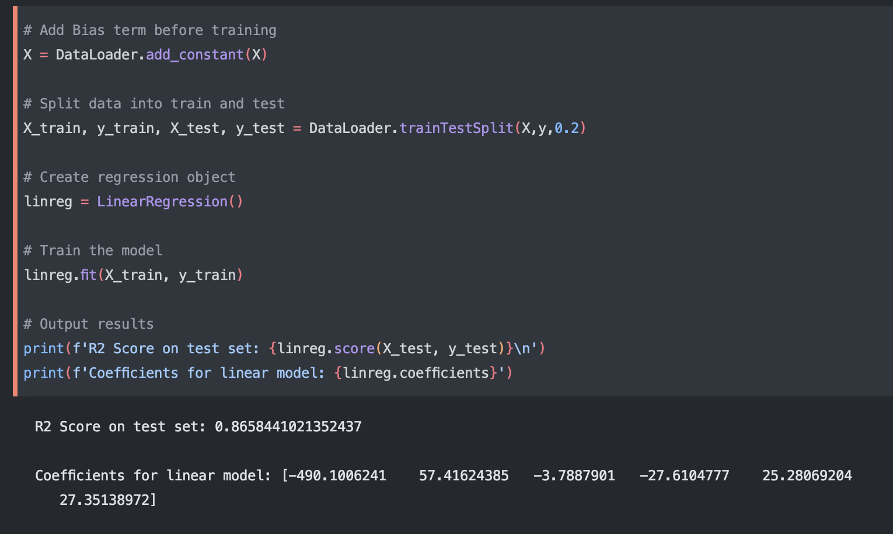
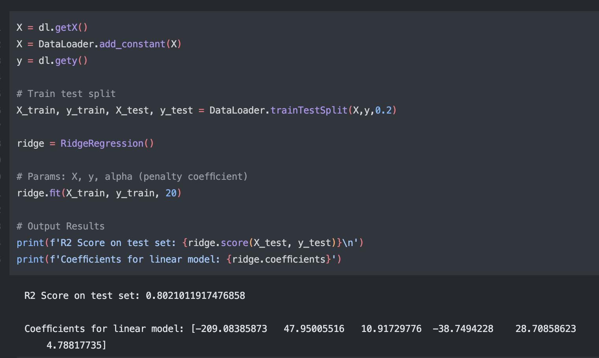
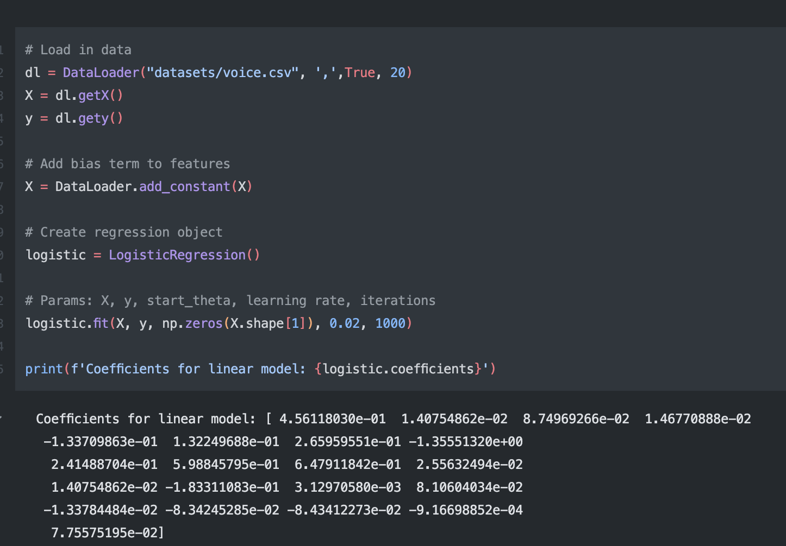

## [Screenshots]

Linear Regression

Ridge Regression

Logistic Regression

## [Description]

In this project, my aim was to create my own machine learning library (mostly) from scratch. Because one of Python's most popular ML libraries, Sci-kit Learn, is written mostly in Python, I thought I might be able to make some faster algorithms by writing it in C++ and then importing into Python with PyBind11.

## [Resources]

* [Eigen Library](https://eigen.tuxfamily.org/index.php?title=Main_Page) for Matrix Algebra operations.
* [AI Coding YouTube video](https://www.youtube.com/watch?v=jKtbNvCT8Dc&t=885s) for data input inspiration.

## [How to Compile and Run]

Compiled with: ``g++ -std=c++20 -shared -undefined dynamic_lookup -I./pybind11/include/ -I./include -I./include/eigen `python3.9 -m pybind11 --includes` src/*.cpp -o DaveML.so `python3.9-config --ldflags` ``
This creates a shared library that can be imported into python using `import DaveML`

## [Design]

My project consists of 4 classes: DataLoader, LinearRegression, RidgeRegression, and LogisticRegression. DataLoader takes in a filepath of a data file and converts it to Eigen Matricies. LinearRegression takes in features and a target and fits a linear regression to the data. RidgeRegression inherits from LinearRegression and overloads the `fit` function. This allows you to manually control overfitting by tweaking the `alpha` variable. Logistic Regression takes in data and will allow you to make binary classifications.

## [Technical Challenge]

Because I was modeling after the Python way of doing Machine Learning, I had to start with a module to read in data. First I read in the file, line-by-line, as a vector of vectors, separating each element by the specified delimiter. I then iterated over every element, assigning it to its corresponding location in the resulting Eigen::MatrixXd. I then wrote accesor method to extract the features matrix and the target vector. As I started to think ahead towards the ML part, I decided I needed 3 more data manipulation functions. The first was `add_constant` which adds a column of 1s to an input matrix, allowing you to account for the y-intercept of a linear model. Next, I needed to make a function that splits the data into training and testing sets based on a specified `test_size` which is a value between 0 and 1, representing the proportion of the total size that you want to be allocated as test data. Finally, because some of the models are affecting by the scale of each attribute, I needed to write a standardization function which centers the data at 0 and divides each column by the columnwise standard deviation.

After the data was transformed into the desired state, I could start working on the machine learning part. I started simple with Linear Regression. This class stores theta, the coefficients of the linear equation. This class utilizes QR factorization to approximate the solution to an inconsistent (unsolvable) system. The model is then evaluated with the test data by an $R^2$ score.

Next, I wanted to implement Ridge Regression. This is a variation of Linear Regression which allows you to manually penalize the fit to reduce overfitting. Naturally, this class inherited from LinearRegression because it's identical apart from 1 input parameter. All I had to do was overload the `fit` member function.

Finally, I wanted to include some sort of classification model so I chose Logistic Regression. This model was, by far, the hardest model to implement because it doesn't have a straight forward, matrix algebra, approach. I started by defining some helper functions like the sigmoid and cross-entropy loss functions. The `fit` function then takes utilizes batch gradient-descent to iteratively minimize the cost function. Finally, the `predict` function uses the trained model to calculate the probablity of each class and returning the value of the most likely one.

Overall, the hardest part of this project was figuring out how to convert mathematical equations into C++ code while also maintaining efficiency.

## [Results]

All this work resulted in a python module that can compute long ML computations in the blink of an eye. Please see `README.md` to see how this library can be utilized in Python using the given datasets.
